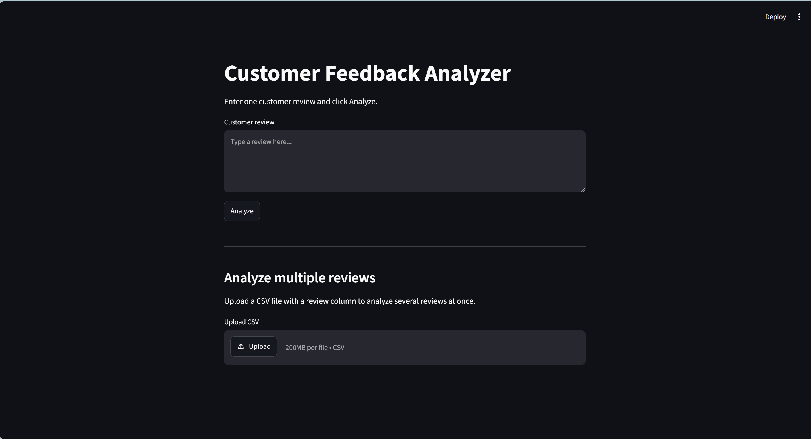
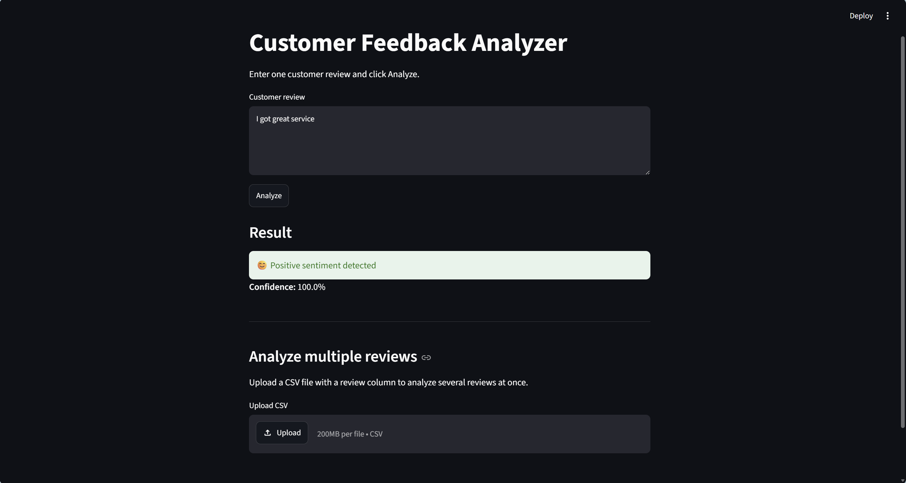
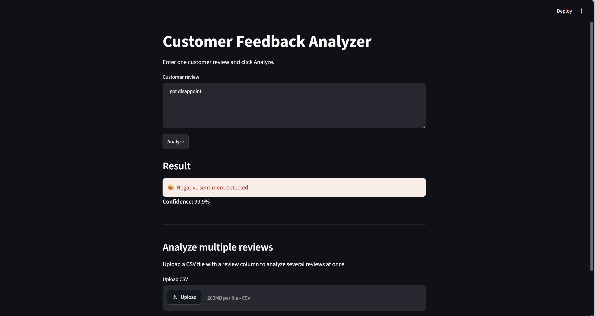

# 💬 Customer Feedback Analyzer


An AI-powered sentiment analysis web application that classifies customer reviews as **Positive** or **Negative** using a pre-trained Hugging Face Transformer model. The application also supports batch sentiment analysis by uploading CSV files.

---

# 📌 Project Overview

Customer Feedback Analyzer is a beginner-friendly Natural Language Processing (NLP) project built using **Python**, **Streamlit**, and **Hugging Face Transformers**.

The application enables businesses to quickly understand customer opinions by automatically classifying reviews and displaying prediction confidence.

---

# 🚀 Features

## 🔍 Single Review Analysis
- Analyze one customer review
- Predict Positive or Negative sentiment
- Display AI confidence score

## 📂 Batch Review Analysis
- Upload CSV files
- Analyze multiple customer reviews
- View results in a table
- Download analyzed CSV

## 🤖 AI Powered
- Uses Hugging Face Transformers
- Powered by PyTorch
- Real-time sentiment prediction

---

# 🏗️ Project Architecture

```
                Customer Review
                       │
                       ▼
            Hugging Face Transformer
                       │
                       ▼
          Sentiment Prediction Model
                       │
             ┌─────────┴─────────┐
             ▼                   ▼
        Positive            Negative
             │
             ▼
      Confidence Score
             │
             ▼
      Streamlit Web Interface
```

---

# 📁 Project Structure

```
customer_feedback_analyzer/
│
├── app.py                 # Streamlit application
├── sentiment.py           # AI sentiment analysis logic
├── requirements.txt
├── README.md
│
├── data/
│   └── sample_reviews.csv
│
├── screenshots/
│   ├── home.png
│   ├── sample1.png
│   └── sample2.png
│
└── .venv/
```

---

# ⚙️ Technologies Used

| Technology | Purpose |
|------------|---------|
| Python | Backend Programming |
| Streamlit | Web Application |
| Hugging Face Transformers | NLP Model |
| PyTorch | Deep Learning Backend |
| Pandas | CSV Processing |

---

# 🧠 AI Model

This project uses the Hugging Face **Sentiment Analysis Pipeline** based on the DistilBERT model.

The model predicts

- Positive
- Negative

along with a confidence score.

---

# 📸 Screenshots

## Home Page



---

## Single Review Prediction



---

## CSV Batch Analysis



---

# 📊 Sample Input

| Review |
|---------|
| Excellent product |
| Worst purchase ever |
| Amazing customer support |

---

# 📈 Sample Output

| Review | Sentiment | Confidence |
|---------|------------|------------|
| Excellent product | Positive | 99.8% |
| Worst purchase ever | Negative | 99.5% |
| Amazing customer support | Positive | 99.9% |

---

# 🚀 Installation

Clone the repository

```bash
git clone https://github.com/asif-visionary/customer_feedback_analyzer.git

cd customer_feedback_analyzer
```

Create a virtual environment

```bash
python -m venv .venv
```

Activate it

### Windows

```bash
.venv\Scripts\activate
```

### Linux/macOS

```bash
source .venv/bin/activate
```

Install dependencies

```bash
pip install -r requirements.txt
```

---

# ▶️ Run the Application

```bash
streamlit run app.py
```

Open your browser

```
http://localhost:8501
```

---

# 💡 How It Works

1. Enter a customer review.
2. Click **Analyze**.
3. The Hugging Face model predicts the sentiment.
4. The confidence score is displayed.
5. Upload a CSV file to analyze multiple reviews at once.
6. Download the analyzed CSV.

---

# 📂 CSV Format

Your CSV should contain one of these columns:

```
review
```

or

```
text
```

or

```
feedback
```

or

```
comments
```

Example

| review |
|----------|
| Excellent service |
| Bad quality |
| Amazing experience |

---

# 🎯 Learning Outcomes

This project demonstrates practical experience with:

- Natural Language Processing (NLP)
- Hugging Face Transformers
- Streamlit Web Development
- PyTorch Inference
- CSV Processing with Pandas
- Python Programming
- AI Model Integration

---

# 🔮 Future Improvements

- Neutral sentiment detection
- Emotion analysis
- Sentiment charts
- Word cloud visualization
- Search and filter reviews
- Multi-language support
- Deploy on Streamlit Community Cloud

---

# 👨‍💻 Author

**Mohamed Asif**

Cybersecurity Student | AI & Python Enthusiast

- GitHub: https://github.com/asif-visionary
- LinkedIn: https://www.linkedin.com/in/mohamed-asif-a-852830326/

---

# ⭐ Support

If you found this project useful, consider giving it a ⭐ on GitHub.

---

# 📜 License

This project is licensed under the MIT License.