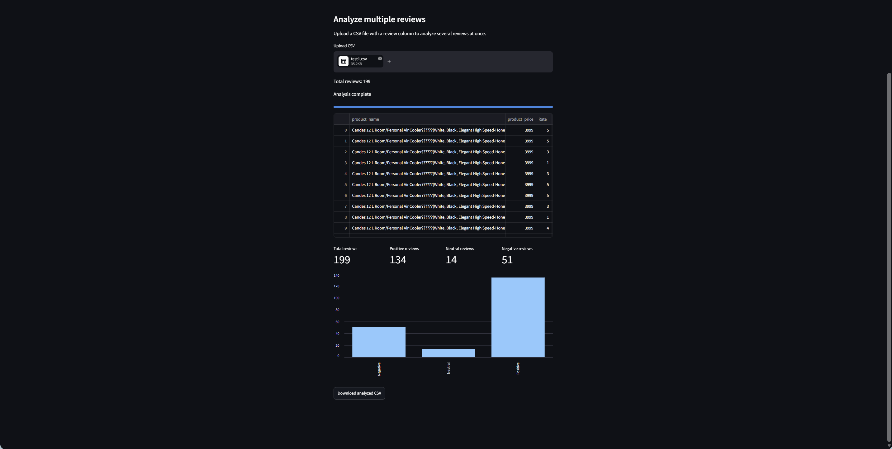

# 💬 Customer Feedback Analyzer


An AI-powered web application that analyzes customer reviews and predicts whether the sentiment is **Positive** or **Negative** using a pre-trained Hugging Face Transformer model. The application also supports **batch sentiment analysis** by uploading CSV files.

---

# 📌 Project Overview

Customer Feedback Analyzer is a beginner-friendly **Natural Language Processing (NLP)** project developed using **Python**, **Streamlit**, **Hugging Face Transformers**, **PyTorch**, and **Pandas**.

The application helps users quickly analyze customer feedback by predicting the sentiment of individual reviews or an entire CSV file while displaying the prediction confidence score.

---

# 🌟 Features

## 🔍 Single Review Analysis

- Analyze a single customer review
- Predict Positive or Negative sentiment
- Display AI confidence score
- Simple and interactive Streamlit interface

---

## 📂 Batch Review Analysis

- Upload CSV files
- Automatically detect review columns
- Analyze multiple customer reviews
- Display results in an interactive table
- Download analyzed CSV

---

## 🤖 AI-Powered Prediction

- Uses Hugging Face Transformers
- Powered by PyTorch
- Fast real-time sentiment prediction
- Confidence score for every prediction

---

# 🏗️ Project Architecture

```text
               Customer Review / CSV
                        │
                        ▼
                 Streamlit Web App
                        │
                        ▼
             Hugging Face Transformer
                        │
                        ▼
             Sentiment Analysis Model
                        │
             ┌──────────┴──────────┐
             ▼                     ▼
         Positive             Negative
             │
             ▼
      Confidence Score
             │
             ▼
      Display Results / Download CSV
```

---

# 📁 Project Structure

```text
customer_feedback_analyzer/
│
├── app.py
├── sentiment.py
├── requirements.txt
├── README.md
├── .gitignore
│
├── data/
│   └── sample_reviews.csv
│
└── screenshots/
    ├── home.png
    ├── sample1.png
    └── sample2.png
```

---

# ⚙️ Tech Stack

| Technology | Purpose |
|------------|---------|
| Python | Backend Programming |
| Streamlit | Web Application |
| Hugging Face Transformers | NLP Model |
| PyTorch | Deep Learning Backend |
| Pandas | CSV Processing |

---

# 🧠 AI Model

This project uses the **Hugging Face Sentiment Analysis Pipeline** based on the **DistilBERT (SST-2)** pre-trained model.

The model predicts:

- 😊 Positive
- 😞 Negative

along with a confidence score for every prediction.

> **Note:** The current model supports only **binary sentiment classification (Positive/Negative)**. Neutral or mixed opinions are classified into the closest sentiment category.

---

# 📸 Screenshots

## 🏠 Home Page


---

## 😊 Single Review Prediction


---

## 📊 Batch CSV Analysis



---

# 🚀 Installation

Clone the repository

```bash
git clone https://github.com/asif-visionary/customer_feedback_analyzer.git

cd customer_feedback_analyzer
```

Create a virtual environment

```bash
python -m venv .venv
```

### Windows

```bash
.venv\Scripts\activate
```

### Linux / macOS

```bash
source .venv/bin/activate
```

Install dependencies

```bash
pip install -r requirements.txt
```

---

# ▶️ Run the Application

```bash
streamlit run app.py
```

Open your browser at:

```text
http://localhost:8501
```

---

# 💡 How It Works

1. Enter a customer review or upload a CSV file.
2. The review text is sent to a pre-trained Hugging Face Transformer model.
3. The model predicts the sentiment.
4. The application displays:
   - Sentiment
   - Confidence Score
5. For CSV uploads, the results can be downloaded after analysis.

---

# 📂 Supported CSV Format

The application automatically looks for one of these columns:

- `review`
- `Review`
- `text`
- `feedback`
- `comments`
- `summary`

Example:

| review |
|----------|
| Excellent service |
| Bad quality |
| Amazing experience |

---

# 📄 Sample Dataset

A sample CSV file (`sample_reviews.csv`) is included in the repository for testing the batch sentiment analysis feature.

---

# ⚠️ Limitations

- Supports only **Positive** and **Negative** sentiment.
- Neutral or mixed reviews are classified into the closest sentiment category.
- Predictions depend on the pre-trained Hugging Face model.

---

# 💼 Skills Demonstrated

- Python Programming
- Natural Language Processing (NLP)
- Streamlit Web Development
- Hugging Face Transformers
- PyTorch Inference
- CSV Processing with Pandas
- AI Model Integration
- Machine Learning Inference

---

# 🔮 Future Improvements

- Support Positive, Neutral, and Negative sentiment
- Fine-tune a custom transformer model
- Sentiment analytics dashboard
- Interactive charts and visualizations
- Search and filter analyzed reviews
- Multi-language sentiment analysis
- Deploy on Streamlit Community Cloud

---

# 👨‍💻 Author

**Mohamed Asif**

Cybersecurity Student | AI Enthusiast | Python Developer

- **GitHub:** https://github.com/asif-visionary
- **LinkedIn:** https://www.linkedin.com/in/mohamed-asif-a-852830326/

---

# ⭐ Support

If you found this project useful, please consider giving it a ⭐ on GitHub.

---

# 📜 License

This project is licensed under the **MIT License**.